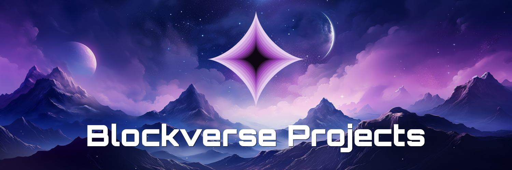

# DMC Universe - Projects

This repository contains the projects that are listed on the [DMC Universe](https://www.dmc-universe.space) website.

## Why is this repository here?

To make it as easy as possible for new projects to added and existing projects to update their data, we have created this repository. It contains all the data that is displayed on the website. This way, you can easily create a pull request to add your project to the website.

## How to add your project

**▶▶ If you have no experience with GitHub and would like to add your project, please fill out [this form](https://ntgr0y6lisg.typeform.com/to/pM7fRos6). ◀◀**

1. 🔱 Fork this repository _(Not documented here)_
2. 👾 Prepare your logo
3. 📝 Add your project details
4. 🔄 Create a pull request _(Not documented here)_
5. 🚦 Wait for possible feedback
6. 🎉 Your project is now listed on [dmc-universe.space](https://www.dmc-universe.space/)

### 1. 🔱 Fork this repository

You can read more about forking a repository [here](https://docs.github.com/en/get-started/quickstart/fork-a-repo).

### 2. 👾 Prepare your logo

- Must be a vector SVG
  - Do not convert JPG/PNG/etc. to SVG
  - Do not embed JPG/PNG/etc. in the SVG
- Must start with the `<svg>` opening element
- Must end with the `</svg>` closing element
- Must be scalable
  - Don't use static width/height attributes, use a `viewBox` instead
- Must not contain whitespace around the SVG
- Must not include the `doctype` element
- File name
  - Must be lowercase
  - Must not contain spaces
  - Must not contain special characters
  - The file name should be the same as the `img` property in the `projects.json` file.

The logo should be placed in the [`/data/logos`](https://github.com/0ptim/dmc-universe-projects/tree/1ac49ea6b43160c3dd12ea4b742105fcd92bf8d4/media) folder and must have the same name as the project ID.

For example, if your project ID is `my-project`, the logo should be named `my-project.svg`

### 3. 📝 Add your project details

Add your project details to the [`/data/projects.json`](https://github.com/0ptim/dmc-universe-projects/blob/56c9a4d08e3c46bbc6fbb2055de740a684bf4c8d/data/projects.json) file. The file is a JSON array of objects. Each object represents a project.

All the fields are described in the [field descriptions](./field_descriptions.md) file.

For a simpler start, you can copy the following template and fill in the details.

```json
{
  "name": "",
  "description": "",
  "longDescription": "",
  "mainURL": "",
  "img": "",
  "inTheMarketYouTubeVideoId": "",
  "SpotlightXSpaceURL": "",
  "SpotlightXSpaceAudiofile": "",
  "SpotlightBlogpostURL": "",
  "status": "",
  "customVideo": {
    "title": "",
    "description": "",
    "youTubeVideoId": ""
  },
  "links": [
    {
      "url": "",
      "type": ""
    }
  ],
  "team": [
    {
      "name": "",
      "role": "",
      "img": "",
      "links": [
        {
          "url": "",
          "type": ""
        }
      ]
    }
  ],
  "tags": [""]
}
```

### 4. 🔄 Create a pull request

You can read more about creating a pull request [here](https://docs.github.com/en/pull-requests/collaborating-with-pull-requests/proposing-changes-to-your-work-with-pull-requests/about-pull-requests).

### 5. 🚦 Wait for acceptance or feedback

We will review your pull request and either accept it or give you feedback on what needs to be changed.

### 6. 🎉 Your project is now listed on [dmc-universe.space](https://www.dmc-universe.space/)

Just go to the [DMC Universe](https://www.dmc-universe.space/) website and search for your project.
